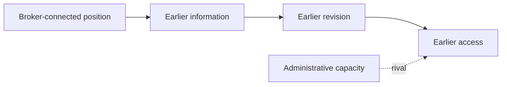

# Relational Gatekeeping: Theory-to-Case Lab

> Synthetic teaching example; not a real publication or empirical case.
> Related notes: [[Demo_Relational_Gatekeeping_Reading_Note]] · [[Demo_Relational_Gatekeeping_Scholarly_Reception_and_Applications]]

> [!tip] Reading guide
> `[P]` = synthetic focal text; `[S]` = synthetic reception material; `[A]` = demonstration analysis or application. `[P/A]` and `[S/A]` mark short mixed claims; the slash means “source material plus analysis,” not a new source type. Prefer separating source claims from analysis, and use labels only where provenance could otherwise be unclear. **Bold** marks core concepts or mechanisms; <mark>highlight</mark> marks directly reusable findings; <u>underline</u> marks boundaries or misreadings; *italics* preserve wording-sensitive terms. Styling never replaces provenance.

## Basic Information

- Author: Demo Author
- Year: 2026
- Title: Relational Gatekeeping
- Type: synthetic example
- Zotero: Zotero link pending
- Research case: Two fictional neighborhood archives.
- Selected path: causal

## Case and Explanandum

- Outcome: Archive North gains municipal access six months before Archive South.
- Puzzle: Both archives are formally eligible and begin with similar staffing.
- Unit and level: Organizations in a municipal network.
- Context: A fictional 2025 grant cycle.

## Theory–Case Fit

| Dimension | Theory | Case | Fit / gap | Adjustment |
|---|---|---|---|---|
| Problem | Unequal access | Unequal grant timing | Good | None |
| Level | Interorganizational | Interorganizational | Good | None |
| Evidence | Sequence and resource control | Messages and drafts | Partial | Recover missing records |

## Selected Explanatory or Interpretive Path

`[A]` The selected causal path is: outcome difference → broker position → information asymmetry → selective transmission → changed preparation options → earlier access.

## Concepts, Positions, Resources, and Constraints

| Actor | Position | Concept | Resource or constraint | Evidence | Class |
|---|---|---|---|---|---|
| Archive North | Broker-connected | Bridging resource | Early procedural information | Synthetic message p. 1 | `[A]` |
| Municipal broker | Gatekeeper | Information control | Can transmit guidance | Focal claim p. 7 | `[P]` |

## Step-by-Step Explanation

| Step | Claim | Case inference | Evidence | Locator | Rival | Disconfirmation | Confidence |
|---|---|---|---|---|---|---|---|
| 1 | Position affects information access `[P]` | North receives guidance first `[A]` | Dated messages | p. 1 | Capacity | Both receive guidance simultaneously | Medium |
| 2 | Timing changes preparation options `[S]` | North revises earlier `[A]` | Draft history | p. 3 | Prior expertise | Revisions predate contact | Medium |

## Theory-to-Case Visual

> [!info] Purpose of this visual
> This visual shows **the proposed sequence and its rival** because prose alone obscures temporal dependency. Nodes represent **case states**; solid arrows represent **the proposed causal sequence**, while the dotted arrow represents **a rival pathway**. Evidence class: `[A]`, grounded in synthetic `[P]` and `[S]` claims. It should not be interpreted as empirical confirmation.

**Interpretation:** The sequence identifies temporal observations needed to distinguish gatekeeping from pre-existing capacity.

## Rival Explanations or Alternative Readings

| Rival | Better explanation | Favoring evidence | Adjudication | Uncertainty |
|---|---|---|---|---|
| Capacity | Fast revision independent of brokers | Drafts predate contact | Compare document chronology | Missing drafts |

## Counterfactual, Negative Case, or Alternative Reading

- Counterfactual: Equalize broker access; the theory predicts a smaller timing gap.
- Negative case: A broker-connected archive that still applies late.
- If wrong: Preparation differences appear before any information asymmetry.

## Evidence Plan

| Claim | Evidence | Material | Strategy | Status |
|---|---|---|---|---|
| Information arrived earlier | Timestamps | Messages | Chronology | Synthetic only |
| Information changed options | Revision sequence | Drafts | Process tracing | Synthetic only |

## Scope and Boundaries

- Explains: Unequal timing where brokers control relevant information.
- Sensitizes: Informal relational access.
- <u>Cannot explain: Timing differences that precede broker contact.</u>
- Boundary: Equivalent bridging ties or fully public procedures.

## Paper-Ready Analytical Paragraph

`[A]` Although both fictional archives were formally eligible, Archive North's broker-connected position provided earlier procedural information, which expanded its revision window and plausibly produced earlier access. The account would weaken if drafts show that North's preparation advantage preceded broker contact; administrative capacity therefore remains the main rival.

## Related Links

- [[Demo_Relational_Gatekeeping_Reading_Note]]
- [[Demo_Relational_Gatekeeping_Scholarly_Reception_and_Applications]]
- Gatekeeping
