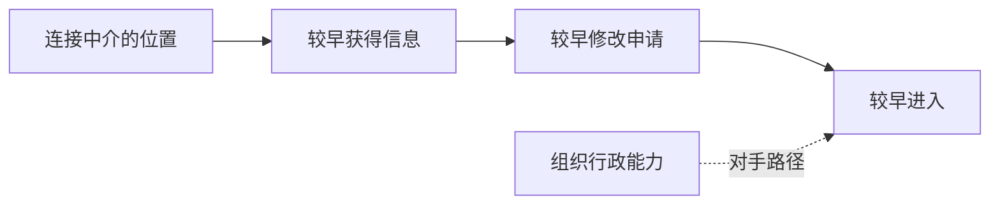

# 《关系守门》：理论解释案例实验室

> 合成教学示例；并非真实出版物或经验案例。
> 关联笔记：[[示例_关系守门_文献解读]] · [[示例_关系守门_学界评价与理论应用]]

> [!tip] 阅读提示
> `[P]`＝合成原著；`[S]`＝合成评价材料；`[A]`＝演示性分析或应用。`[P/A]` 与 `[S/A]` 只表示简短的“来源材料＋分析”混合论断，不是新的来源类别。优先拆开来源陈述与分析，只在来源可能混淆时使用标记。**粗体**表示核心概念或机制；<mark>高亮</mark>表示可直接用于研究的发现；<u>下划线</u>表示边界或常见误读；*斜体*表示措辞敏感的术语。格式不能代替证据来源。

## 基本信息

- Author: 示例作者
- Year: 2026
- Title: 关系守门
- Type: synthetic example
- Zotero: Zotero 链接待补
- 研究案例: 两个虚构社区档案馆。
- 选定路径: 因果

## 案例与待解释对象

- 结果：北馆比南馆提前六个月获得市政进入机会。
- 谜题：两者正式资格与初始人员数量相近。
- 单位与层次：市政网络中的组织。
- 语境：虚构的2025年资助周期。

## 理论—案例匹配度

| 维度 | 理论 | 案例 | 匹配 / 缺口 | 调整 |
|---|---|---|---|---|
| 问题 | 进入不平等 | 资助时间不同 | 较好 | 无 |
| 层次 | 跨组织 | 跨组织 | 较好 | 无 |
| 证据 | 顺序与资源控制 | 信息和草稿 | 部分 | 补齐缺失记录 |

## 选定的解释路径

`[A]` 选定路径是：结果差异 → 中介位置 → 信息不对称 → 选择性传递 → 准备选项变化 → 更早进入。

## 概念、位置、资源与约束

| 行动者 | 位置 | 概念 | 资源或约束 | 证据 | 类别 |
|---|---|---|---|---|---|
| 北馆 | 连接中介 | 桥接资源 | 较早获得程序信息 | 合成信息第1页 | `[A]` |
| 市政中介 | 守门位置 | 信息控制 | 能够传递指导 | 原著第7页 | `[P]` |

## 逐步解释

| 步骤 | 命题 | 案例推论 | 证据 | 页码 | 对手 | 反证 | 可信度 |
|---|---|---|---|---|---|---|---|
| 1 | 位置影响信息获得 `[P]` | 北馆先收到指导 `[A]` | 带日期的信息 | 第1页 | 组织能力 | 双方同时收到 | 中 |
| 2 | 时间改变准备选项 `[S]` | 北馆较早修改 `[A]` | 草稿历史 | 第3页 | 既有经验 | 修改早于联系 | 中 |

## 理论—案例解释图

> [!info] 图示用途
> 这张图用于展示**建议的时间顺序及其对手路径**，因为单靠文字不易看清各步骤的依赖关系。节点表示**案例状态**；实线箭头表示**建议的因果顺序**，虚线表示**对手路径**。证据类别：`[A]`，并以合成 `[P]` 与 `[S]` 命题为基础。它不表示已经获得经验验证。

**图后说明：** 这条路径明确了区分守门机制与既有组织能力所需的时间证据。

## 对手解释或替代阅读

| 对手解释 | 更好解释什么 | 支持证据 | 判别方式 | 不确定性 |
|---|---|---|---|---|
| 组织能力 | 不依赖中介的快速修改 | 草稿早于联系 | 比较文档时间 | 草稿缺失 |

## 反事实、负案例或替代阅读

- 反事实：让双方获得同等中介信息，理论预计时间差缩小。
- 负案例：连接中介但仍然延迟申请的档案馆。
- 如果解释错误：准备差异会早于信息不对称出现。

## 证据计划

| 判断 | 所需证据 | 材料 | 策略 | 状态 |
|---|---|---|---|---|
| 信息较早到达 | 时间戳 | 信息记录 | 建立时间线 | 仅为合成 |
| 信息改变选项 | 修改顺序 | 草稿 | 过程追踪 | 仅为合成 |

## 适用范围与边界

- 能够解释：中介控制相关信息时的时间差异。
- 能够提示：非正式关系性进入。
- <u>无法解释：早于中介接触的时间差异。</u>
- 边界：桥接关系均等或程序完全公开。

## 可直接写入论文的分析段

`[A]` 虽然两个虚构档案馆都具备正式资格，北馆与中介相连的位置使其较早获得程序信息，扩大了修改时间窗口，并可能促成更早进入。如果草稿显示北馆的准备优势早于中介接触，该解释就会削弱，因此组织能力仍是主要对手解释。

## 相关链接

- [[示例_关系守门_文献解读]]
- [[示例_关系守门_学界评价与理论应用]]
- 守门机制
