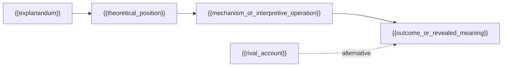

{{title}}: Theory-to-Case Lab

> Evidence labels: `[P]` focal source; `[S]` verified scholarship; `[A]` reconstruction or proposed case application
> Related notes: [[{{author}}_{{short_title}}_Reading_Note]] · [[{{author}}_{{short_title}}_Scholarly_Reception_and_Applications]]

> [!tip] Reading guide
> **Bold** marks core concepts, mechanisms, or conclusions; <mark>highlight</mark> marks findings directly useful to the user's research; <u>underline</u> marks boundaries, negations, or recurrent misreadings; *italics* preserve titles or wording-sensitive terms. Styling never replaces `[P]`, `[S]`, or `[A]` provenance.

## Basic Information

- Author:
- Year:
- Title:
- Type: book / article / report / chapter
- Zotero: [Open in Zotero]({{zotero_uri}})
- Research case:
- Selected path: causal / interpretive / critical / genealogical / normative

> If the Zotero URI cannot be verified, replace the preceding line with `- Zotero: Zotero link pending`. Never infer an item key.

## Case and Explanandum

- Outcome, contrast, practice, text, meaning, or power relation to explain:
- Why this is a research puzzle rather than a description:
- Unit and level of analysis:
- Period, setting, and relevant context:

## Theory–Case Fit

| Dimension | Theory requires | Case provides | Fit / gap | Required adjustment |
|---|---|---|---|---|
| Problem | | | | |
| Unit and level | | | | |
| Scope | | | | |
| Concepts | | | | |
| Evidence | | | | |

## Selected Explanatory or Interpretive Path

Use one pathway unless a justified bridge is stated.

- Causal: `outcome difference → theoretical position → resources and constraints → mechanism → changed choice set → outcome and distributional effects`
- Interpretive / critical / genealogical / normative: `text/practice → conceptual location → interpretive operation → meaning or power relation revealed → alternative reading → boundary`

## Concepts, Positions, Resources, and Constraints

| Actor / material | Theoretical position | Relevant concept | Resource, capacity, meaning, or constraint | Evidence | Class (`P/S/A`) |
|---|---|---|---|---|---|

## Step-by-Step Explanation

| Step | Theoretical claim | Case inference | Required evidence | Source / locator | Rival or alternative reading | Disconfirming evidence | Confidence |
|---|---|---|---|---|---|---|---|

## Theory-to-Case Visual

> [!info] Purpose of this visual
> This visual shows **the selected explanatory or interpretive sequence** because prose alone obscures the order and dependencies. Nodes represent **analytical steps** and arrows represent **the relation defined above**. Evidence class: `[A]`, grounded in cited `[P]` and `[S]` claims. It should not be interpreted as **empirical confirmation or causation unless the evidence warrants that claim**.

**Interpretation:**

## Rival Explanations or Alternative Readings

| Rival | What it explains better | Evidence that would favor it | How to adjudicate | Residual uncertainty |
|---|---|---|---|---|

## Counterfactual, Negative Case, or Alternative Reading

- Counterfactual or negative case, when causally appropriate:
- Alternative reading, when interpretively appropriate:
- Expected observation if the focal account is wrong:

## Evidence Plan

| Claim | Required evidence | Source or material | Collection / reading strategy | Verification status |
|---|---|---|---|---|

## Scope and Boundaries

- What the theory explains well:
- What it only sensitizes the researcher to:
- <u>What the theory cannot explain:</u>
- Transfer conditions and boundary cases:

## Paper-Ready Analytical Paragraph

`[A]` Draft the paragraph here. Flag every statement that still requires primary-source or empirical verification.

## Related Links

- Reading note: [[{{author}}_{{short_title}}_Reading_Note]]
- Scholarly reception and applications: [[{{author}}_{{short_title}}_Scholarly_Reception_and_Applications]]
- Related concepts:
  - [[]]
- Related literature:
  - [[]]
- Related projects:
  - [[]]
