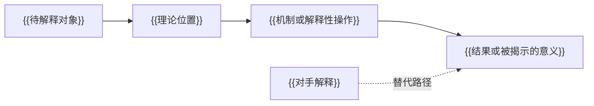

{{title}}：理论解释案例实验室

> 关联笔记：[[{{author}}_{{short_title}}_文献解读]] · [[{{author}}_{{short_title}}_学界评价与理论应用]]

> [!tip] 阅读提示
> `[P]`＝原著或核心文本明确表达的内容；`[S]`＝已核实的外部学术研究；`[A]`＝本笔记的重构、评价、综合或应用建议。`[P/A]` 与 `[S/A]` 只用于简短的混合论断，斜线表示“来源材料＋分析”，不是新的来源类别。优先把来源陈述与分析拆开；只有无法自然拆分时才使用组合标记。证据标记只在来源可能混淆处出现，不逐段、逐句或逐条重复。**粗体**表示核心概念、机制或结论；<mark>高亮</mark>表示可直接服务于用户研究的发现；<u>下划线</u>表示边界、否定条件或常见误读；*斜体*保留书刊名或措辞敏感的原文术语。格式不能代替证据来源。

## 基本信息

- Author:
- Year:
- Title:
- Type: book / article / report / chapter
- Zotero: [Open in Zotero]({{zotero_uri}})
- 研究案例:
- 选定路径: 因果 / 解释 / 批判 / 谱系 / 规范

> 若无法确认 Zotero URI，将上行替换为 `- Zotero: Zotero 链接待补`，不得猜测 item key。

## 案例与待解释对象

- 待解释的结果、差异、实践、文本、意义或权力关系：
- 为什么这是研究谜题而不只是现象描述：
- 分析单位与层次：
- 时期、场域与相关语境：

## 理论—案例匹配度

| 维度 | 理论要求 | 案例提供 | 匹配 / 缺口 | 所需调整 |
|---|---|---|---|---|
| 问题 | | | | |
| 单位与层次 | | | | |
| 适用范围 | | | | |
| 概念 | | | | |
| 证据 | | | | |

## 选定的解释路径

除非明确说明桥接理由，否则只选用一条路径。

- 因果：`结果差异 → 理论位置 → 资源与约束 → 作用机制 → 选择空间变化 → 结果与分配后果`
- 解释 / 批判 / 谱系 / 规范：`文本/实践 → 概念定位 → 解释性操作 → 被揭示的意义或权力关系 → 替代阅读 → 适用边界`

## 概念、位置、资源与约束

| 行动者 / 材料 | 理论位置 | 相关概念 | 资源、能力、意义或约束 | 证据 | 类别（`P/S/A`） |
|---|---|---|---|---|---|

## 逐步解释

| 步骤 | 理论命题 | 案例推论 | 所需证据 | 来源 / 页码 | 对手解释或替代阅读 | 反证 | 可信度 |
|---|---|---|---|---|---|---|---|

## 理论—案例解释图

> [!info] 图示用途
> 这张图用于展示**选定解释路径的步骤与依赖关系**，因为单靠文字不易同时看清顺序和连接。节点表示**分析步骤**，箭头表示**上文定义的关系**。证据类别：`[A]`，并以已引用的 `[P]` 与 `[S]` 命题为基础。它不表示**已经获得经验验证，也不在证据不足时自动表示因果关系**。

**图后说明：**

## 对手解释或替代阅读

| 对手解释 | 它能更好解释什么 | 支持它的证据 | 如何判别 | 剩余不确定性 |
|---|---|---|---|---|

## 反事实、负案例或替代阅读

- 适用于因果分析的反事实或负案例：
- 适用于解释研究的替代阅读：
- 如果本解释错误，预计会观察到什么：

## 证据计划

| 判断 | 所需证据 | 来源或材料 | 收集 / 阅读策略 | 核实状态 |
|---|---|---|---|---|

## 适用范围与边界

- 理论能够较好解释什么：
- 理论只能帮助研究者注意什么：
- <u>理论无法解释什么：</u>
- 转用条件与边界案例：

## 可直接写入论文的分析段

`[A]` 在此起草。凡仍需核对原著或经验材料的陈述，必须明确标记。

## 相关链接

- 文献解读：[[{{author}}_{{short_title}}_文献解读]]
- 学界评价与理论应用：[[{{author}}_{{short_title}}_学界评价与理论应用]]
- 相关概念：
  - [[]]
- 相关文献：
  - [[]]
- 相关项目：
  - [[]]
